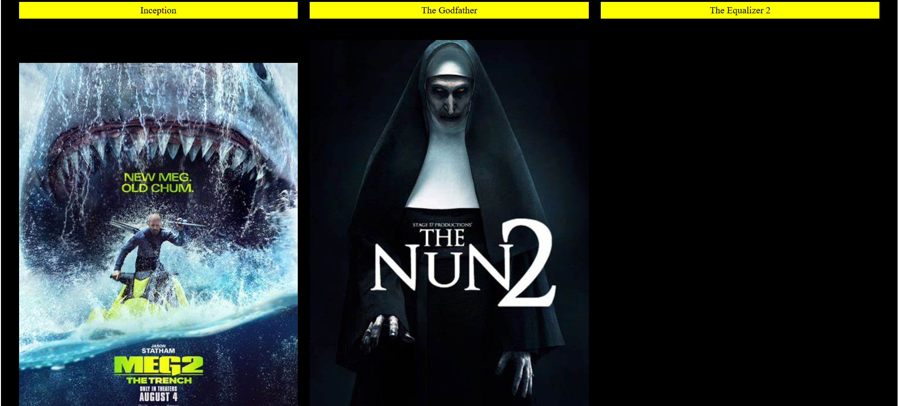
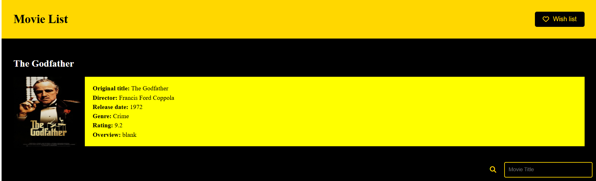

# Movie App 🎬

A web application to browse, search, and view details of movies.

## Features
- Browse popular movies
- View detailed movie information (title, director, release date, genre, rating, etc.)
- Add movies to your wishlist
- Search for movies by title

## Screenshots

### Movie List



### Movie Details



## Installation

1. Clone the repository:
   ```bash
   git clone https://github.com/yourusername/movie-app.git
 


## Usage
1. Browse the list of popular movies.
2. Click on a movie to view detailed information.
3. Add movies to your wishlist or use the search bar to find a specific movie.


## Contributing
Feel free to open issues or submit pull requests if you'd like to contribute to the project.


## License
This project is licensed under the MIT License.
